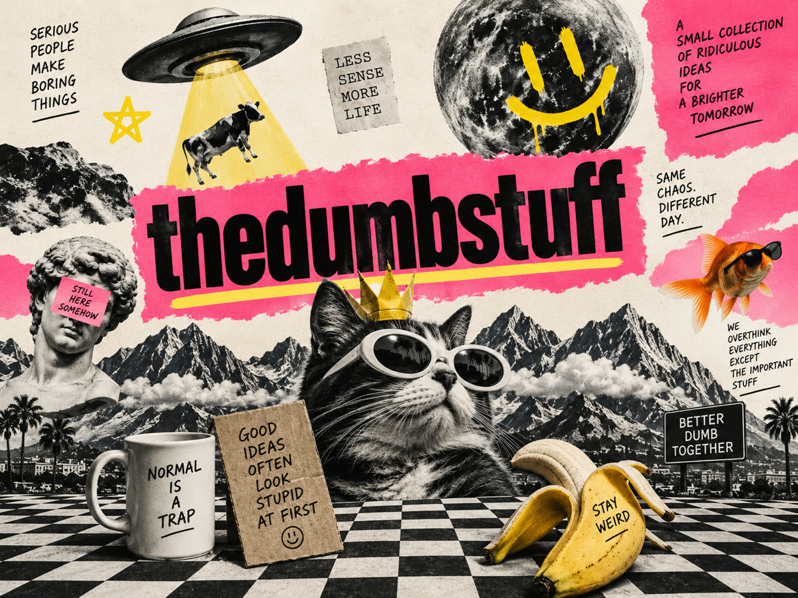

<p align="center">
  <a href="https://github.com/thedumbstuff"></a>
</p>

# DollyGrip

**A local REST gateway and MCP server for the DaVinci Resolve scripting API.** An open-source project by [thedumbstuff](https://github.com/thedumbstuff).

On a film set, the dolly grip is the crew member who physically drives the camera so the director gets the shot. DollyGrip does that for DaVinci Resolve: it sits next to a running Resolve Studio and exposes its scripting API as clean, documented HTTP endpoints (and, with `dollygrip mcp`, as MCP tools) - so any language, tool, or AI agent can drive your edit, grade, Fusion titles and delivery.

```bash
uv tool install "dollygrip[mcp]"   # or: pipx install "dollygrip[mcp]" / pip install "dollygrip[mcp]"
dollygrip doctor                   # diagnose your Resolve scripting setup
dollygrip serve                    # http://127.0.0.1:4747/docs
```

```bash
curl http://127.0.0.1:4747/api/v1/health
# {"gateway":"ok","resolve":"connected","product":"DaVinci Resolve Studio","version":"21.0.4.5"}
```

## Why

Resolve's Python scripting API is powerful but awkward to reach: it needs the right environment variables, the right Python build, the same machine, and a long-lived process. That locks out everything that is not local Python - shell scripts, Node tools, n8n / Zapier-style automations, CI jobs, and AI coding agents.

DollyGrip turns all of that into `curl` (or an MCP tool call):

- **The whole scripting surface** - 300+ typed operations covering every object in Blackmagic's API for Resolve 21 (project manager, media pool, timelines, timeline items, markers, color versions / node graphs / groups / gallery, Fusion compositions, render queue, presets, Media Storage, Studio AI features) - plus the undocumented Fusion comp/tool API for data-driven Text+ titles.
- **Auto-discovery** - finds the scripting module on Windows / macOS / Linux in the documented install paths; `RESOLVE_SCRIPT_API` / `RESOLVE_SCRIPT_LIB` still win if you set them.
- **One persistent connection** - lazily connected, probed per request, transparently reconnects when Resolve restarts, serialized behind a lock (the fusionscript handle is not thread-safe).
- **Crash-proof discovery** - fusionscript segfaults (no exception - the interpreter dies) on Python builds it dislikes; DollyGrip proves the import in a sacrificial subprocess first, so the gateway survives and answers 503 with a hint instead of dying, and `dollygrip doctor` scans your interpreters for one that works.
- **Stable addressing** - timeline items by unique id, clips by id or name anywhere in the pool, bins by path, `current` for whatever is under the playhead. No object handles leak across HTTP.
- **Sharp edges sanded off** - source-fps frames, absolute record frames, `useCustomSettings` ordering, marker dicts flattened to lists, Fusion point tables from plain `[x, y]` lists (see below).
- **Stock footage to timeline** - search Pexels / Pixabay / Coverr per script keyword, pick clips that cover a voiceover (script order or random, no source repeated before every source has appeared), and stitch them as real Resolve timeline items with fill/fit framing - the MoneyPrinterTurbo move, but the result is a timeline you can still grade and re-cut.
- **A guarded escape hatch** - `POST /api/v1/exec` runs raw Python against the live scripting objects. Off by default.
- **Interactive docs for free** - OpenAPI/Swagger at `/docs`; the same document generates the MCP tools.

Born out of a real production pipeline: assembling multi-track vertical social reels (spokesperson video + alpha graphics overlays + per-sentence subtitle clips + SFX beds) in Resolve, fully scripted. Live-verified end to end on Resolve Studio 21.0.4.

## Requirements

- DaVinci Resolve **Studio** (the free edition does not allow external scripting), running, with **Preferences > System > General > External scripting using: Local**.
- Python 3.9+ on the same machine (3.10+ for the MCP server) - but note fusionscript is picky about Python **builds**: against Resolve Studio 21 a python.org 3.13 worked while a uv-managed standalone 3.11 segfaulted at import. If `dollygrip doctor` reports a crash, its interpreter scan will tell you which of your Pythons works; the repo pins 3.13 for development.

## Quickstart: assemble, title and render a timeline

```bash
# 1. point the media pool at a bin (create it if missing)
curl -X POST localhost:4747/api/v1/mediapool/folders -H 'content-type: application/json' \
  -d '{"path": "auto-edits", "create": true}'

# 2. import media into it
curl -X POST localhost:4747/api/v1/mediapool/import -H 'content-type: application/json' \
  -d '{"paths": ["D:/shoot/interview.mp4", "D:/shoot/broll.mov"]}'

# 3. create a vertical 30fps timeline with an extra overlay track
curl -X POST localhost:4747/api/v1/timelines -H 'content-type: application/json' \
  -d '{"name": "reel-v1", "width": 1080, "height": 1920, "fps": 30, "extra_video_tracks": 1}'

# 4. place clips at exact frames (record_frame is 0-based from the timeline start)
curl -X POST localhost:4747/api/v1/timelines/current/append -H 'content-type: application/json' \
  -d '{"items": [
        {"clip_name": "interview.mp4", "start_frame": 0, "end_frame": 432, "record_frame": 0},
        {"clip_name": "broll.mov", "track_index": 2, "record_frame": 90}
      ]}'

# 5. drop a data-driven Text+ title at the playhead
curl -X PUT  localhost:4747/api/v1/timelines/current/playhead -H 'content-type: application/json' -d '{"timecode": "00:00:01:00"}'
curl -X POST localhost:4747/api/v1/timelines/current/generators -H 'content-type: application/json' \
  -d '{"kind": "fusion_title", "name": "Text+", "text": "Homework, but with a tutor"}'

# 6. render and wait for it
JOB=$(curl -s -X POST localhost:4747/api/v1/render/jobs -H 'content-type: application/json' \
  -d '{"preset": "H.264 Master", "settings": {"TargetDir": "D:/out", "CustomName": "reel-v1", "SelectAllFrames": true}}' | jq -r .job_id)
curl -X POST "localhost:4747/api/v1/render/jobs/$JOB/wait?timeout=900"
```

More in [`examples/`](examples/) - including [`data_driven_titles.py`](examples/data_driven_titles.py), which styles and animates one Text+ per caption, and [`counting_cards.py`](examples/counting_cards.py), a complete kids' counting video made from nothing but API-built Fusion titles (background + animated digit + word + stars) and an offline TTS voiceover.

### Or as one recipe

The same pipeline as a single call - each step is any operation by name, and later steps can reference earlier results:

```bash
curl -X POST localhost:4747/api/v1/recipes/run -H 'content-type: application/json' -d @examples/recipe_reel.json
# or without a server at all:
dollygrip run examples/recipe_reel.json
```

```json
{"steps": [
  {"name": "bin",    "op": "set_current_folder", "args": {"path": "auto-edits", "create": true}},
  {"name": "import", "op": "import_media",       "args": {"paths": ["D:/shoot/interview.mp4", "D:/shoot/broll.mov"]}},
  {"name": "tl",     "op": "create_timeline",    "args": {"name": "reel-v1", "width": 1080, "height": 1920, "fps": 30, "extra_video_tracks": 1}},
  {"name": "cut",    "op": "append_items",       "args": {"items": [{"clip_name": "interview.mp4", "record_frame": 0}, {"clip_name": "broll.mov", "track_index": 2, "record_frame": 90}]}},
  {"name": "look",   "op": "patch_item",         "args": {"item_id": "{{ steps.cut.results[1].item_id }}", "properties": {"Opacity": 80}}},
  {"name": "title",  "op": "insert_generator",   "args": {"kind": "fusion_title", "name": "Text+", "text": "Homework, but with a tutor"}},
  {"name": "render", "op": "add_job",            "args": {"preset": "H.264 Master", "settings": {"TargetDir": "D:/out", "CustomName": "reel-v1", "SelectAllFrames": true}}},
  {"name": "wait",   "op": "wait_for_job",       "args": {"job_id": "{{ steps.render.job_id }}", "timeout": 900}}
]}
```

`dry_run: true` returns the resolved plan without touching Resolve; the `run` MCP tool exposes the same thing to agents, so Claude can plan a whole edit and execute it in one call.

## Making it look good

Tools are not taste. [`docs/VIDEO_CRAFT.md`](docs/VIDEO_CRAFT.md) is the production checklist an agent (or you) should follow: beat sheet first, voice before picture, one display font plus one body font with glyph coverage, safe margins, a palette with real contrast, an entrance motion on every element, card fades via `Merge.Blend` keyframes, a music bed and loudness prepared with ffmpeg, captions, and a QA pass that extracts frames and looks at them. It also lists what Resolve's API cannot do (transitions, clip volume/opacity keyframes, Fairlight) and the workaround for each. The MCP server hands it to Claude as `dollygrip://craft`.

## Stock footage: keywords in, timeline out

Give it the script's keywords (in order), a voiceover (or a duration) and an aspect, and it fills the timeline with stock b-roll:

```bash
export PEXELS_API_KEY=...            # free at pexels.com/api (also PIXABAY_API_KEY, COVERR_API_KEY)
dollygrip serve --media-dir D:/stock # where downloads land (default ~/DollyGrip/stock)

curl -X POST localhost:4747/api/v1/stock/b-roll -H 'content-type: application/json' -d '{
  "terms": ["city at night", "student studying", "phone camera close-up"],
  "voiceover_path": "D:/vo/take3.wav", "voiceover_track": 1,
  "provider": "pexels", "aspect": "portrait", "max_clip_duration": 4,
  "mode": "script_order", "track_index": 1, "fit": "fill", "bin": "stock"
}'
```

What happens, step by step (each is also its own endpoint so you can intervene):

1. `POST /stock/search` - per keyword, the provider is queried with the aspect; results are filtered by orientation, minimum duration and the rendition whose short side reaches 1080; searches are cached for 24 h and API keys rotate.
2. `POST /stock/plan` - clips are cut into segments of at most `max_clip_duration`; `script_order` round-robins through the keywords so the footage follows the script, `random` shuffles; the longest segment of every source comes before any source repeats; the list loops until the voiceover (plus 0.1 s) is covered and the last shot is trimmed to the end. Chosen clips are downloaded with a JSON source record (provider, author, page URL) for attribution.
3. `POST /stock/assemble` - files are imported once into the bin, each shot is appended at its record frame with the source range converted using the clip's OWN fps (the source-fps trap), `fit: fill` sets Resolve's Scaling to Fill (cover) or `fit` to letterbox, and the voiceover is placed on the audio track. Resolve's own clock measures the voiceover when you pass a path.

Add captions with `POST /timelines/current/subtitles/auto` (Studio) or per-line Text+ titles, then `add_job`. Pexels and Pixabay content is free to use; keep the `attribution` list the plan returns if you publish.

## Using DollyGrip with Claude

DollyGrip was built so an AI agent can operate Resolve like an editor, colorist and Fusion artist. Three ways to wire it up:

### 1. Claude Code as an MCP server (recommended)

`dollygrip mcp` runs the gateway as an MCP server over stdio - every endpoint becomes a tool (tool name = operation name, e.g. `append_items`, `text_plus`, `add_job`). Register it once:

```bash
# from a published install
claude mcp add dollygrip -- dollygrip mcp

# or straight from a checkout
claude mcp add dollygrip -- uv run --directory /path/to/dollygrip dollygrip mcp
```

Then just talk to it:

> "Open the TutorBee project, list the timelines, and tell me how long the R8 cut is."
>
> "Create a 1080x1920 30fps timeline called `promo-v2`, put `spokes.mp4` on V1 from frame 0, `art.mov` on V2 starting at frame 30, add a Text+ title reading 'Snap the question' at 00:00:01:00 in gold, then render it with the H.264 Master preset to D:/out and wait for it."
>
> "Grab a still of every clip, export the grades as .drx to D:/looks, and copy the grade from the first clip to the rest."

All ~290 tools at once is a lot of context. Pick a profile, or trim with tags (the OpenAPI tags you see in `/docs`):

```bash
claude mcp add dollygrip -- dollygrip mcp --profile editor     # editor | colorist | motion | delivery | core | all
claude mcp add dollygrip -- dollygrip mcp --tags "projects,mediapool,timelines,timeline items,render"
```

Add `--allow-exec` only if you want Claude to be able to run arbitrary Python inside Resolve via the `exec_code` tool.

The server also publishes MCP **resources** Claude can read to self-serve: `dollygrip://openapi.json`, `dollygrip://operations` (every op with its arguments), and from a checkout `dollygrip://craft` (the [video craft guide](docs/VIDEO_CRAFT.md) - the server's instructions tell the agent to read it before building any video), `dollygrip://gotchas` and `dollygrip://readme`. The `run` tool takes a whole recipe, so a multi-step edit is one tool call.

### 2. Claude Desktop (or any MCP client)

`claude_desktop_config.json`:

```json
{
  "mcpServers": {
    "dollygrip": {
      "command": "dollygrip",
      "args": ["mcp", "--profile", "editor"]
    }
  }
}
```

Cursor, Windsurf, Zed and other MCP clients take the same `command` + `args`.

### 3. Plain HTTP from any agent

Run `dollygrip serve` and let the agent `curl`. Drop this into your project's `CLAUDE.md` (or system prompt) so Claude Code knows the gateway exists:

```markdown
## DaVinci Resolve
A DollyGrip gateway runs at http://127.0.0.1:4747 (Swagger: /docs, OpenAPI: /openapi.json).
Drive Resolve through it with curl - never import DaVinciResolveScript directly.
Start with GET /api/v1/health, GET /api/v1/projects/current, GET /api/v1/timelines/current/items.
Frames: source in/out are in SOURCE fps; record_frame is 0-based from the timeline start.
Timeline items are addressed by the `id` from /timelines/current/items; clips by name or id.
Before building or styling any video, read docs/VIDEO_CRAFT.md in the DollyGrip repo (beat sheet first,
voice before picture, fonts with glyph coverage, safe margins, palette, entrance motion, card fades,
music bed, captions, frame-grab QA) and docs/GOTCHAS.md before timeline work.
```

### What Claude can do through it

| You say | DollyGrip calls |
|---|---|
| "Rough-cut these 12 clips in order, 3 seconds each" | `import_media` → `timeline_from_clips` / `append_items` |
| "Push every V2 clip 10 frames later and drop opacity to 80%" | `list_items` → `patch_item` (Inspector properties) |
| "Add chapter markers at each scene change" | `detect_scene_cuts` → `add_marker_timeline` |
| "Caption it" | `auto_subtitles` (Studio) or per-line `insert_generator` (fusion_title) + `text_plus` |
| "Match the look of clip 3 across the interview" | `add_color_group` → `assign_to_color_group`, or `copy_grades` |
| "Apply this .cube on node 2 of every clip" | `refresh_luts` → `set_node_lut_clip` |
| "Deliver a TikTok and a YouTube version" | `add_job` with presets → `wait_for_job` |
| "Save a .drx of every graded clip" | `grab_stills` → `export_stills` |
| "Animate the title size in over 10 frames" | `set_tool_keyframes` on the Text+ tool |
| "What can I tweak on this lower-third template?" | `list_tool_inputs` (control type, range, default per parameter) |
| "Insert this shot at the playhead and push everything down" | `ripple_insert` |
| "Do the whole rough cut, title and export in one go" | `run` (a recipe) |
| "Make a 40-second vertical explainer about X from stock footage, over this voiceover" | `stock_b_roll` (Pexels search -> shot plan -> timeline), then `auto_subtitles` + `add_job` |

Things the Resolve API itself does not expose (so neither can any agent): building color nodes or reading grades back, the Fairlight mixer, Edit-page keyframes. Moving/trimming/splitting an item in place is not native either - DollyGrip's `relocate` and `split` rebuild the item for you (grade preserved when the move does not overlap itself on the same track). `/exec` covers the rest.

## API surface (v1)

300+ operations under `/api/v1`; every request/response shape is in the interactive docs at `/docs`. By area:

| Area | Highlights |
|---|---|
| System | `health` · `system/info` · `system/constants` · `system/page` · layout & preference presets · `system/quit` (confirm) · Media Storage: `storage/volumes`, `storage/files`, `storage/add-to-mediapool` |
| Projects | list/create/open/rename/save/close/delete · settings · presets · project folders · import/export/archive/restore · databases · Fairlight presets · AI speech generation |
| Media pool | bins (tree/create/move/delete/export/import .drb) · clips by id or name (properties, metadata, color, flags, markers, mark in/out) · import files / image sequences / subclips · proxies · relink/unlink · replace · mattes · audio sync · stereo · selection · metadata CSV · transcription / classification / deblur / IntelliSearch / slate |
| Timelines | list/create/from-clips/import (AAF/EDL/XML/FCPXML/DRT/OTIO) · settings · tracks (add/rename/lock/enable/delete) · `append` · **ripple-insert** at the playhead · delete/link items · compound & Fusion clips · generators / titles / **Fusion Text+ with text** · playhead · mark in/out · markers · export (17 formats) · duplicate/delete · stills · thumbnail (JSON or PNG) · auto subtitles · scene cuts · voice isolation · Dolby Vision |
| Timeline items | list (with 0-based frames) · get/patch (name, enabled, color, **all Inspector properties**) · delete (ripple) · **relocate** (move/trim, optionally with linked audio - re-append preserving properties, markers, Fusion comps and, when possible, the grade) · **split** · flags · markers · linked · audio mapping · takes · stabilize · smart reframe · magic mask · caches · burn-in |
| Color | versions · CDL · copy grades · LUT export · node graphs (clip / timeline / group pre+post: LUT, cache, enable, DRX, reset) · color groups · gallery albums & stills (import/export/label/delete) · export frame · keyframe mode |
| Fusion | comps (list/add/import/rename/load/export/delete) · tools (list/add/get/rename/bypass/delete) · **input discovery** (every parameter of any tool or template with control type, range, default, value) · set inputs · **expressions** · connect · **keyframes** · `text-plus` helper · current comp on the Fusion page |
| Render | formats/codecs/resolutions · presets (list/load/save/delete/import/export) · queue (add with preset/format/mode/settings, list, delete) · start/stop · **wait** · **progress as server-sent events** · quick export · burn-in presets |
| Stock | `GET /stock/providers` · `POST /stock/search` · `POST /stock/download` · `POST /stock/plan` · `POST /stock/assemble` · **`POST /stock/b-roll`** (keywords + voiceover -> stitched timeline in one call) |
| Recipes | `POST /recipes/run` - a whole pipeline as ordered steps with `{{ steps.name.path }}` templating, dry-run, stop-on-error · `GET /recipes/operations` · `dollygrip run recipe.json` |
| Tools | `tools/timecode` (frames ⇄ timecode, drop-frame aware) |
| Escape hatch | `POST /exec` (requires `--allow-exec`) - namespace: `resolve, fusion, project_manager, project, media_pool, media_storage, timeline, gallery` |

### The sharp edges we sand off

The scripting API has traps that cost real hours. DollyGrip's endpoints encode the workarounds and document the rest in [docs/GOTCHAS.md](docs/GOTCHAS.md):

- `startFrame`/`endFrame` are in **source-fps** frames, not timeline fps.
- `recordFrame` is absolute - Resolve timelines usually start at 01:00:00:00, so the gateway takes a 0-based frame and adds the offset for you (and reports `start_rel`/`end_rel` on items).
- A clip's **Mark In/Out silently trims appends** that do not pass explicit frames.
- Per-timeline custom settings only stick if `useCustomSettings` is set first - the create and settings endpoints do the dance in order.
- `resolve.*` constants are not enumerable through `dir()`; the export/subtitle/sync endpoints take plain names and look the values up.
- Fusion wants 1-based tables for points and colors; send `[x, y]` / `[r, g, b, a]` lists.
- Overlapping appends on one track get pushed, stills and numbered image sequences misbehave, OTIO re-import needs `import_source_clips: false` - see the gotchas doc.

## Security

This gateway is **remote control for an application with filesystem access** - treat it accordingly.

- Binds to `127.0.0.1` by default. Keep it there.
- `--token <secret>` requires `Authorization: Bearer <secret>` on every call (health and docs stay open).
- `POST /exec` is **disabled by default**; `--allow-exec` turns it on. It is arbitrary code execution on the host, by design - never combine it with a non-localhost bind.
- `dollygrip mcp` runs in-process over stdio: nothing listens on the network at all.

## Development

```bash
git clone https://github.com/thedumbstuff/dollygrip && cd dollygrip
uv sync --extra mcp   # installs with the dev group (pytest, httpx) and the MCP server
uv run pytest         # ~100 tests against an in-memory fake Resolve - no install needed
uv run dollygrip serve
```

Contributions welcome - especially the composite edit operations on the roadmap and more Fusion depth. Match the existing router style, keep the fake in `tests/fake_resolve.py` honest, and add a test per endpoint.

## Disclaimer

DollyGrip is an independent open-source project, not affiliated with or endorsed by Blackmagic Design. "DaVinci Resolve" is a trademark of Blackmagic Design Pty Ltd. Nothing from Resolve is bundled or redistributed here - the gateway imports the scripting module from your own installation at runtime.

## License

[Apache-2.0](LICENSE)
